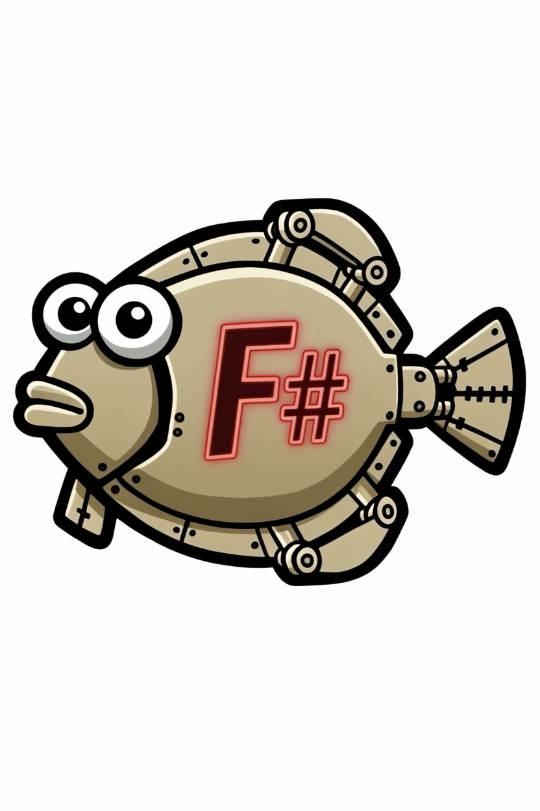

# Floundroid
[](https://dotnet.microsoft.com/download)  
[](https://fsharp.org/)  
[](https://opensource.org/licenses/MIT)  
  
[](https://github.com/Phil-Brooks/Floundroid/releases)

<p align="center">
  
  <br />
  <i>"Functional. Robotic. Fishy."</i>
  <br />
  <strong>Floundroid</strong> is a chess engine built in F#, evolving from clean functional abstractions into a high‑performance bitboard machine.
</p>

---

## 🚀 Latest Stable Release: v0.4.0a (Time Increment Bug Fix)
This maintenance release keeps the v0.4.0 Null-Move Pruning strength gains and fixes UCI time management so `winc` and `binc` increments are included when allocating search time.

### **Key Features in v0.4.0a**
- **Null-Move Pruning (NMP)**: The engine now skips searching moves when the evaluation is so favorable that passing the turn still results in a beta cutoff.
- **Adaptive Depth Reduction**: Dynamically reduces search depth (\(R = 3\) for depth > 6, \(R = 2\) otherwise) to maximize search speed while minimizing tactical blind spots.
- **Safety Heuristics**: Restricts NMP when in check or when the side-to-move has no non-pawn material (avoiding zugzwang pitfalls).
- **UCI Increment Handling**: The `go` command now accounts for `winc` and `binc`, improving play under increment time controls such as `60/1+1`.
- 👉 [**Download Floundroid.exe v0.4.0a**](https://github.com/Phil-Brooks/Floundroid/releases/latest)

---

## 🌊 Why “Floundroid”?
Floundroid reflects the hybrid nature of the project: a traditional handcrafted chess engine built side-by-side with AI assistance. The *droid* suffix acknowledges the collaborative role of tools like Copilot in refining move generation and debugging complex bitwise logic.

---

## 🧠 Philosophy
> **Make impossible chess states unrepresentable, then make the engine fast enough to matter.**

---

## ⭐ Features

### **Search & Performance**
- **Alpha-beta search** with Iterative Deepening and Quiescence search.
- **Null-Move Pruning (NMP)** with adaptive depth reduction.
- **Bitboard representation** using **Magic Bitboards** for sliding pieces.
- **Transposition Table** with Zobrist hashing and aging logic.
- **Heuristics**: MVV-LVA, Killers, and History moves.
- **Draw Detection**: 3-fold repetition, 50-move rule, and Insufficient Material.

### **UCI Support**
- Full UCI protocol compliance.
- **Async search loop**: Remains responsive to GUI commands (`stop`, `quit`) even during deep calculations.
- **Increment-aware time management**: Supports `wtime`, `btime`, `winc`, and `binc` during `go` commands.

---

## 📊 Calibration & Rating

Floundroid is regularly benchmarked against **TSCP 1.81** (est. 1550 Elo).

### **v0.4.0a Performance Baseline**
*   **Final Rating:** `~1458 Elo` (-92.5 relative to TSCP, +/- 65.0) — about **+99 Elo** over the v0.4.0 baseline.
*   **Record vs TSCP**: 29 Wins, 16 Draws, 55 Losses (100 games played)
*   **Score vs TSCP**: 37.0% overall, up from 25.0% in v0.4.0.
*   **Technical Performance:** 
    *   **Time Increment Fix**: Under the `60/1+1` benchmark control, Floundroid now budgets from the side-to-move increment instead of ignoring it.
    *   **Improved Colour Split**: Scored 20.0% as White (10 wins, 0 draws, 40 losses) and 54.0% as Black (19 wins, 16 draws, 15 losses), improving both sides compared with v0.4.0.
    *   **Null-Move Pruning Impact**: Continues to provide deeper, more efficient searches as the main v0.4.x strength feature.
*   **Status**: Stage 4 (Strength Phase) is in progress. Null-Move Pruning and increment-aware time management are implemented and verified.

---

## 🛠 Project Roadmap

### **Stage 1 — Functional Core** ✅
- Strong F# domain modelling and Perft validation.

### **Stage 2 — UCI Engine Interface** ✅
- Async search architecture and iterative deepening.

### **Stage 3 — Mechanical Brain** ✅
- [x] **Bitboards**: Full 64-bit integer representation.
- [x] **Magic Bitboards**: Optimized sliding piece logic.
- [x] **Zobrist Hashing**: Incremental position fingerprinting.
- [x] **Transposition Table**: Advanced caching and entry ageing.
- [x] **Move Ordering**: Heuristics (Killers, History, MVV-LVA).
- [x] **Draw Detection**: 3-fold repetition, 50-move rule, Insufficient Material.

### **Stage 4 — Strength Phase** 🔵
**Status: In Progress**
- [ ] **Evaluation Overhaul**: Mobility, King Safety, and Pawn Structure.
- [ ] **Search Pruning**: Null-move pruning [x], LMR [ ], Aspiration Windows [ ].
- [ ] **Tapered Eval**: Smooth transitions between Middle-game and End-game.

### **Stage 5 — Innovation** 🟣
- [ ] SIMD/Hardware Intrinsics.
- [ ] Optional NNUE evaluation.

---

## 🚀 Getting Started

### **Prerequisites**
- [.NET 10.0 SDK](https://dotnet.microsoft.com/download)

### **Installation**
```bash
git clone https://github.com/Phil-Brooks/Floundroid.git
cd Floundroid
dotnet build -c Release
```
